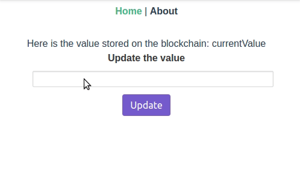

# QTUM starter dApp

<p align="center">		
  		
</p>

This project was generated with [vue-cli](https://github.com/vuejs/vue-cli) version 3.2.1

An Vue [QTUM](https://github.com/qtumproject) starter dApp.

# Demo


# Project setup
Most of this setup comes from the [Developer's Guide to QTUM](https://github.com/qtumproject/qtumbook)

Visit this repo for more and complete guides for developing QTUM dApps
## Install Docker & Node
**https://www.docker.com/get-started**

**https://nodejs.org/en/**

## Download the latest qtumportal image
    docker pull hayeah/qtumportal:latest

## Deploy a Smart Contract
Start qtumd in regtest mode:
```
docker run -it --rm \
  --name myapp \
  -v `pwd`:/dapp \
  -p 9899:9899 \
  -p 9888:9888 \
  hayeah/qtumportal
```
Open a new terminal and enter into the container:
```
docker exec -it myapp sh
```
Generate some initial balance:
```
qcli generate 600
```
Let's generate an address to act as the owner.
```
qcli getnewaddress
```
Let's fund the owner address with 10 QTUM, to pay for gas when we deploy our contract later:
```
qcli sendtoaddress address_from_previous_command 10
```
Finally, we'll need to configure the deployment tool `solar` to use this particular address as the owner:
```
export QTUM_SENDER=address_from_previous_command
```
Use the Solar Smart Contract tool to deploy a contract ( I used the one in the /contracts folder)

    solar deploy MyContract.sol
    
```
🚀  All contracts confirmed
   deployed MyContract.sol =>
      a778c05f1d0f70f1133f4bbf78c1a9a7bf84aed3 (<= Different for you!!)
```
Solar created a `solar.development.json` file for you.
Use `solar status` to check your deployed contracts.
```
✅  MyContract.sol
        txid: 457a5afe15686c0bd596635aeb78d4ff7d2bf6a75df66c7251e89ce4d9c8f6d3
     address: 3db297ee4c225b45219d2a7aa68afea7f4e68832
   confirmed: true
       owner: qdgznat81MfTHZUrQrLZDZteAx212X4Wjj
```
## Install dependencies
```
npm install
```

### Dev server
```
npm run serve
```
### QTUM Portal Authorizations for accepting send requests
```
http://localhost:9899/
```

### Compiles and minifies for production
```
npm run build
```

### Run your tests
```
npm run test
```

### Lints and fixes files
```
npm run lint
```

### Run your end-to-end tests
```
npm run test:e2e
```

### Run your unit tests
```
npm run test:unit
```
